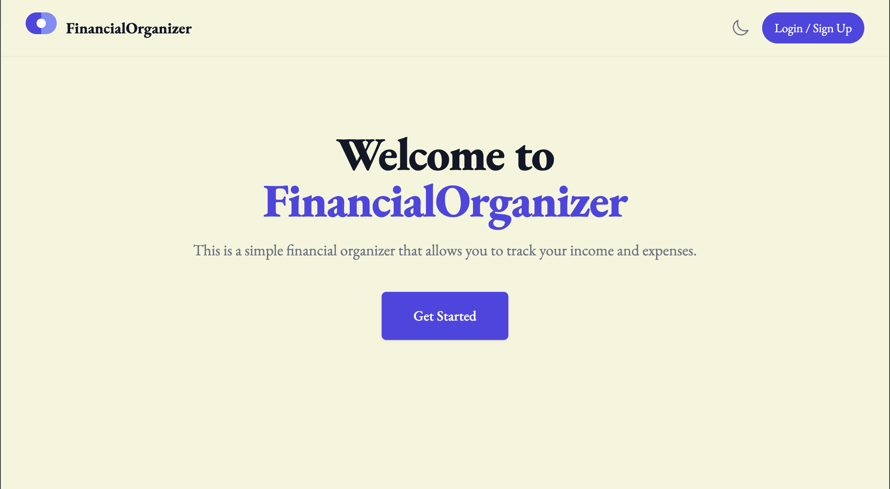
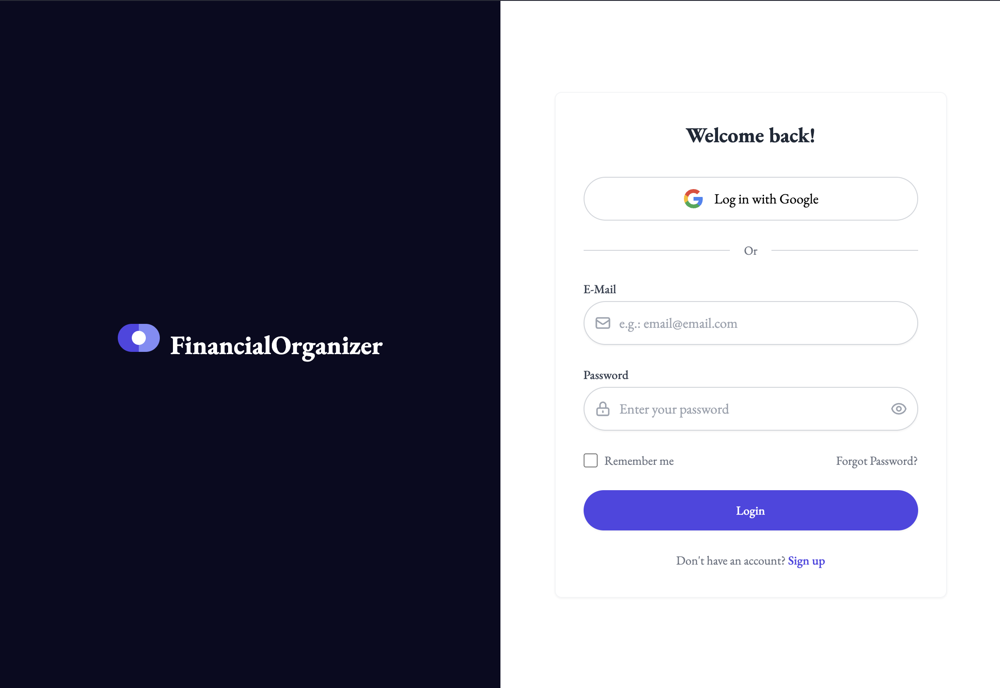

# Finance Tracker Dashboard

Building a personal finance dashboard to help track and categorize finances.

## Features
- **User Authentication**: Secure login and signup functionality

(In Progress)
- **Bank Account Management**: Add and manage multiple bank accounts
- **Transaction Tracking**: Record and categorize financial transactions
- **Subscription Management**: Track recurring subscriptions and billing cycles
- **Dashboard Overview**: Visual summary of financial status
- **Dark/Light Mode**: Toggle between dark and light themes

## Tech Stack
- Next.js
- Tailwind CSS
- FastAPI
- Docker
- MySQL

## Project Structure

```
finance-tracker/
├── project/
│ ├── app/
│ │ ├── about # About page
│ │ ├── analytics # Analytics page
│ │ ├── api/
│ │ │ ├── auth/ # Authentication API routes
│ │ │     ├── login/ # Login route
│ │ │     ├── logout/ # Logout route
│ │ │     ├── session/ # Session management route
│ │ │     └── signup/ # Signup route
│ │ │ └── users/ # User management API routes
│ │ ├── components/ # Reusable UI components
│ │ ├── context/
│ │ │ └── AuthContext.js # Authentication context provider
│ │ ├── dashboard/ # Dashboard page
│ │ ├── login/ # Login page
│ │ ├── signup/ # Signup page
│ │ ├── utils/ # Utility functions
│ │ ├── globals.css # Global styles
│ │ ├── layout.tsx # Root layout component
│ │ ├── page.tsx # Landing page
│ │ └── providers.js # App providers
│ ├── lib/
│ │ ├── db.ts # Database connection utilities
│ │ └── env.ts # Environment validation
│ ├── Dockerfile # Production Dockerfile for frontend
│ ├── Dockerfile.dev # Development Dockerfile for frontend
│ ├── env.d.ts
│ ├── eslint.config.mjs
│ ├── middleware.ts
│ ├── next-env.d.ts
│ ├── next.config.js
│ ├── package.json
│ ├── postcss.config.mjs
│ ├── tailwind.config.ts
│ └── tsconfig.json
├── .env.example # Example environment variables
├── .gitignore
├── docker-compose.yml
├── Makefile
├── schema.sql # Database schema
└── README.md
```

## Getting Started

The project is containerized with Docker Compose and leverages a Makefile for easy Docker configuration.

### Environement Variables

Create a `.env` file in the root directory using the `.env.example` file as a template.

### Using Docker (Recommended)

```bash
# Start all services in development mode
make dev
# Build all services
make build
# Start all services in detached mode
make up
# Stop all services
make down
# Restart all services
make restart
# View logs
make logs
# Clean up Docker resources
make clean
```

Open [http://localhost:3000](http://localhost:3000) with your browser to see the result.





## Contact
Isabella Mercado - imercado@uchicago.edu

Project Link: https://github.com/imercadouchicago/
